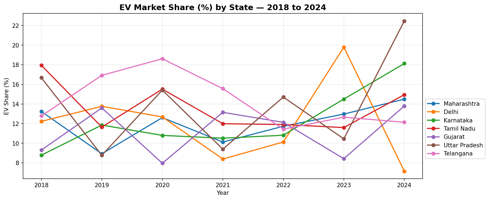
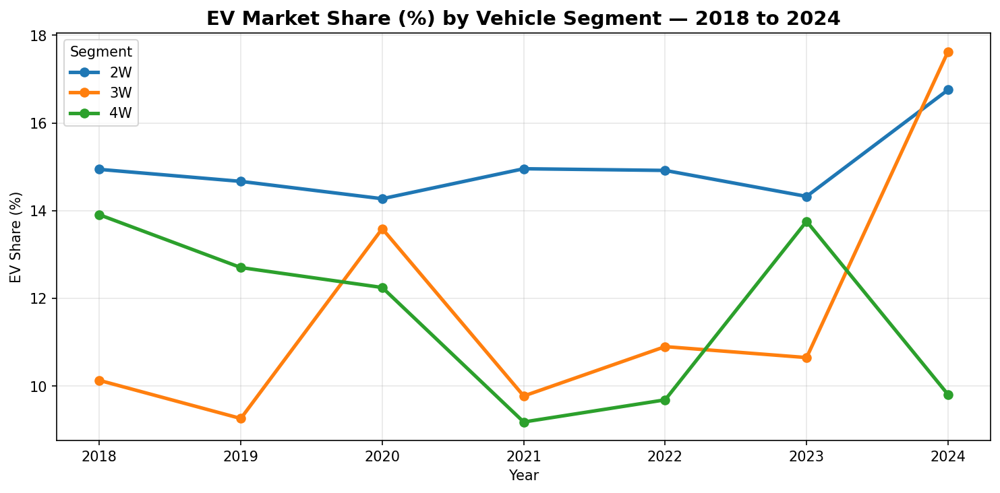
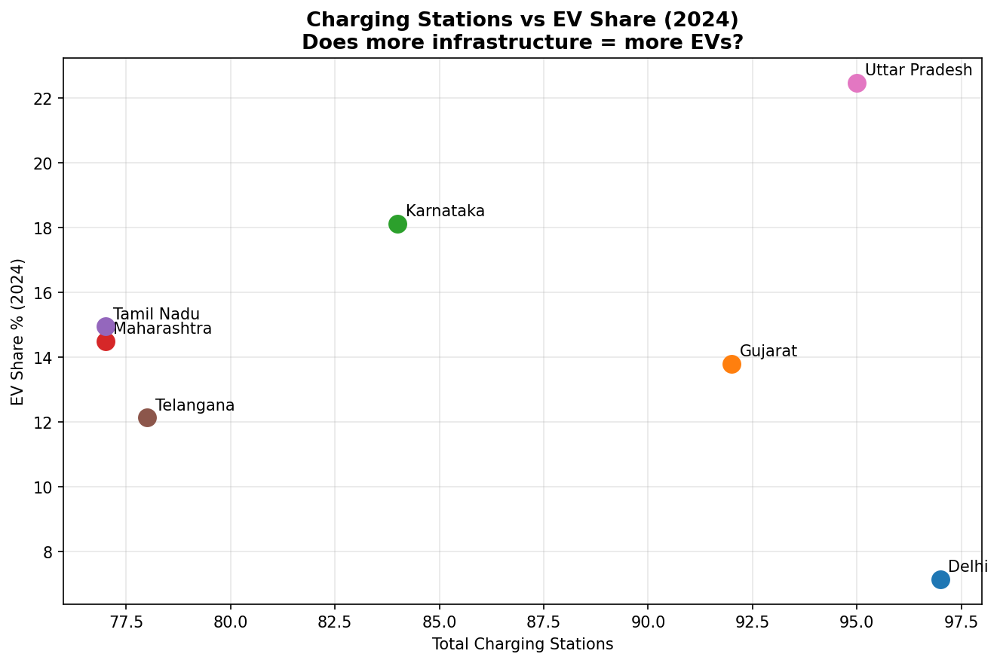
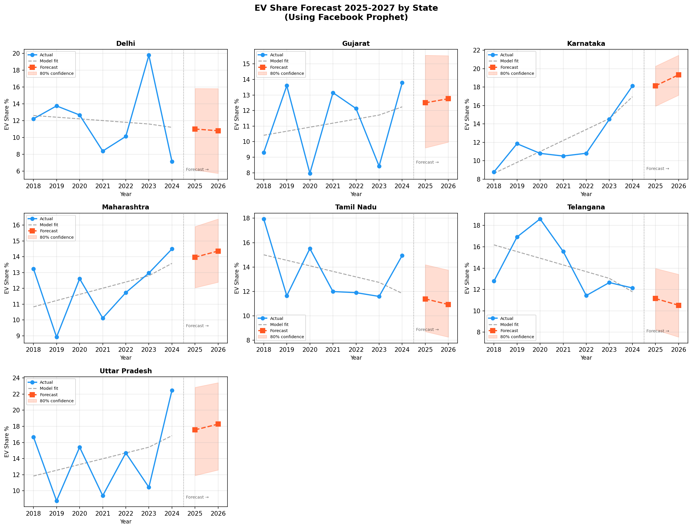

# 🇮🇳 India EV Adoption Analysis
### Predicting the ICE-to-EV Transition Across Indian States (2018–2027)


---

## 📌 Overview

India's automotive sector is undergoing a gradual but uneven shift from Internal Combustion Engine (ICE) vehicles to Electric Vehicles (EVs). While some states are rapidly adopting EVs, others lag despite similar infrastructure and incentives — making the transition dynamics difficult to predict.

This project builds an **end-to-end data analysis and forecasting pipeline** using real Indian vehicle registration and infrastructure data to:

- Analyse EV vs ICE distribution across 7 major states (2018–2024)
- Identify which factors actually drive EV adoption (spoiler: it's not what you'd expect)
- Forecast state-wise EV market share through 2027 using Facebook Prophet

---

## 🔍 Key Findings

| Finding | Detail |
|---------|--------|
| 🏆 **Karnataka leads by 2027** | Projected to reach 19.32% EV share — most consistent growth trajectory |
| ⚡ **Infrastructure ≠ Adoption** | Delhi has the most charging stations (97) but the lowest EV share (7.15% in 2024) |
| 💰 **Money ≠ Adoption** | Tamil Nadu offers ₹1,37,365 incentive yet trails UP which offers only ₹46,490 |
| 🛺 **3W segment surged in 2024** | Auto-rickshaws overtook cars in EV share — driven by e-rickshaw boom in smaller cities |
| 📉 **No single factor predicts EV adoption** | Correlation analysis showed near-zero relationship between infrastructure/policy and EV share |

---

## 📊 Dashboard Preview

| Chart | Insight |
|-------|---------|
|  | EV share over time — chaotic, state-specific patterns |
|  | 2W leads, 3W surged in 2024, 4W declining |
|  | More stations ≠ more EVs — Delhi disproves this clearly |
|  | 2025–2027 predictions with confidence intervals per state |

---

## 🗂️ Project Structure

```
india-ev-adoption/
│
├── data/
│   ├── raw/                          # Original unmodified CSVs
│   │   ├── EV_Ice_Market_Sales_India.csv
│   │   ├── EV_Charging_Infrastructure_India.csv
│   │   ├── EV_Policy_Incentives_India.csv
│   │   └── Vehicle_Battery_Performance_India.csv
│   └── processed/                    # Cleaned outputs from notebook 01
│       ├── master_ev_data.csv
│       └── ev_predictions_2025_2027.csv
│
├── notebooks/
│   ├── 01_data_cleaning.ipynb        # Data audit, cleaning, feature engineering, merging
│   ├── 02_eda_analysis.ipynb         # Exploratory analysis, 5 charts, correlation matrix
│   └── 03_ml_model.ipynb             # Random Forest + Prophet forecasting
│
├── outputs/
│   └── charts/                       # All exported visualisations
│       ├── ev_share_by_state.png
│       ├── ev_share_by_segment.png
│       ├── infra_vs_ev_scatter.png
│       ├── correlation_matrix.png
│       └── ev_forecast_all_states.png
│
├── requirements.txt
└── README.md
```

---

## 🧠 Methodology

### 1. Data Cleaning (`01_data_cleaning.ipynb`)
- Audited 4 datasets across 895 total rows
- Fixed critical bug: city-state mismatches in charging infrastructure data
- Imputed 276 missing values using **group-based median** (by charger type)
- Engineered key features: `ev_share_pct`, `years_policy_active`, `policy_age_years`
- Merged all 4 datasets into one master table (49 rows × 15 columns)

### 2. Exploratory Analysis (`02_eda_analysis.ipynb`)
- Analysed EV share trends across 7 states × 7 years × 3 vehicle segments
- Built correlation matrix revealing near-zero relationship between infrastructure/policy and EV adoption
- Discovered counterintuitive finding: Delhi (most stations) has lowest EV share
- Identified 3W segment surge in 2024 as unexpected market shift

### 3. ML Forecasting (`03_ml_model.ipynb`)

**Attempt 1 — Random Forest Regressor**
- Trained on 2018–2023, tested on 2024
- Result: R² = -0.43 (worse than predicting the mean)
- Learning: features don't linearly predict EV adoption; one model for 7 different states fails

**Attempt 2 — Facebook Prophet (per state)**
- Trained one Prophet model per state on its own 7-year history
- Result: MAE ~1–2% per state (significant improvement)
- Produces confidence intervals — honest about uncertainty
- Forecasts 2025–2027 for all 7 states

---

## 📈 2027 EV Share Predictions

| Rank | State | Predicted EV Share | Confidence Range |
|------|-------|--------------------|-----------------|
| 🥇 | Karnataka | **19.32%** | 17.18% – 21.44% |
| 🥈 | Uttar Pradesh | **18.27%** | 12.88% – 23.36% |
| 🥉 | Maharashtra | **14.36%** | 12.31% – 16.46% |
| 4 | Gujarat | **12.76%** | 9.91% – 16.01% |
| 5 | Tamil Nadu | **10.94%** | 8.18% – 13.47% |
| 6 | Delhi | **10.80%** | 6.01% – 15.44% |
| 7 | Telangana | **10.53%** | 7.65% – 13.12% |

> **Note:** UP's wide confidence band reflects its historically volatile EV adoption pattern.

---

## 🛠️ Tech Stack

| Tool | Purpose |
|------|---------|
| Python 3.10+ | Core language |
| pandas, numpy | Data manipulation |
| matplotlib, seaborn | Visualisation |
| scikit-learn | Random Forest model |
| Facebook Prophet | Time series forecasting |
| Jupyter Notebook | Development environment |

---

## 🚀 How to Run

```bash
# 1. Clone the repo
git clone https://github.com/manaskolaskar/india-ev-adoption-analysis.git
cd india-ev-adoption-analysis

# 2. Install dependencies
pip install -r requirements.txt

# 3. Run notebooks in order
# Open Jupyter and run:
# notebooks/01_data_cleaning.ipynb   → generates data/processed/ files
# notebooks/02_eda_analysis.ipynb    → generates charts
# notebooks/03_ml_model.ipynb        → generates predictions
```

---

## 📦 Dataset

Source: [India EV Market Dataset — Kaggle](https://www.kaggle.com/datasets/shubhamindulkar/ev-datasets-for-the-indian-market-only)

| File | Rows | Description |
|------|------|-------------|
| EV_Ice_Market_Sales_India.csv | 147 | State × segment × year sales data (2018–2024) |
| EV_Charging_Infrastructure_India.csv | 600 | Charging station details across 7 states |
| EV_Policy_Incentives_India.csv | 28 | Policy names, launch years, incentive amounts |
| Vehicle_Battery_Performance_India.csv | 120 | EV model specs — range, price, battery, charging time |

---

## ⚠️ Limitations & Honest Notes

- Dataset covers only **7 states** — not representative of all India
- Only **7 years** of data (49 rows total) — small for ML
- City-state mismatches in charging data required dropping city column
- Battery capacity values appear unrealistic for 2W/3W segments — dataset may be synthetic
- Prophet forecasts assume future follows past trend — cannot predict sudden policy shifts

---

## 💡 What I Learned

- **Feature engineering matters more than model complexity** — `ev_share_pct` and `years_policy_active` were more valuable than any raw column
- **Right tool for right problem** — Random Forest failed; Prophet succeeded because time series data needs time series models
- **Data rarely tells a clean story** — every "obvious" assumption (more chargers = more EVs, higher incentives = more adoption) was disproved by the data
- **Honest analysis > impressive-looking results** — documenting model failures is as valuable as documenting successes

---

*Built as part of a hackathon on India's EV transition — analyzing the ICE-to-EV shift across Indian states using automotive registration and infrastructure data.*